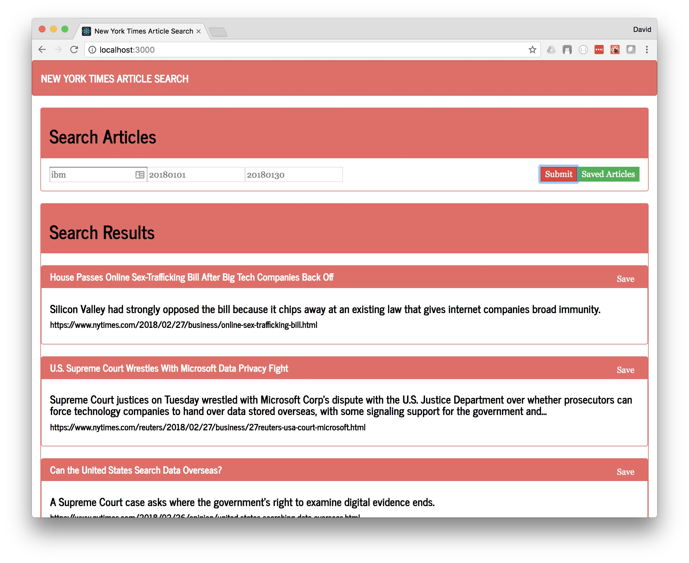

# nytreact
"nyreact" is a New York Times article search and personalized news clipping app.

The app searches article content for keywords, over a specified period of time (begin and end dates) and lists the top 10 articles that match.  The user has the option of saving or "clipping" the article which saves them in a datastore, which can be accessed via the "Saved Searches" tab.

## Description
This application is built using React, Node.js Express, Bootstrap v3.  It runs in the browser on localhost:3000 or is hosted on Heroku [here](https://arcane-anchorage-79289.herokuapp.com/).

## nyreact Interface
After invoking yarn start (node server.js), a broswer window will open with the following address  (localhost:3000), and the user will be able to do a custom search.  After which, they will presented with the following results search screen.

Main screen of nyreact



To run scaper locally, follow the steps below:
```
git clone git@github.com:dpkillian/nyreact.git
cd nyreact/client
yarn install
cd ..
yarn install
yarn start
(default browser will open to localhost:3000)
```
